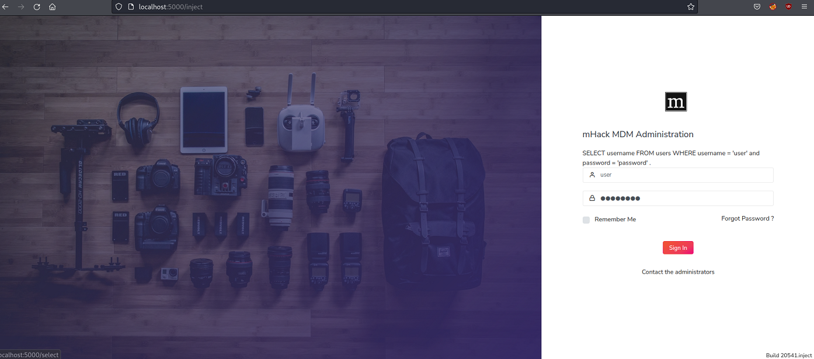

## Web Application Security Demos

A web application with several vulnerabilities for demonstration purposes.
Included vulnerabilities:
- Broken authentication
- Broken session management
- SQL Injection
- Security Misconfiguration
- Cross Site Scripting

## Setup

Clone repository:

> git clone https://github.com/immerio/websecdemos.git

> cd websecdemos

### Docker
> docker build -t websecdemos .

> docker run -d --rm -p 127.0.0.1:5000:5000 websecdemos

or with docker-compose installed:

> docker-compose up -d

Then browse to http://localhost:5000

### Local setup

With Python3 and Pip installed:

> pip install -r requirements.txt
> python demos.py

Then browse to http://localhost:5000

## Usage
Go to [/select](http://localhost:5000/select) and choose one of the demos included. 
There is a short help text for each demo at [/help](http://localhost:5000/help)